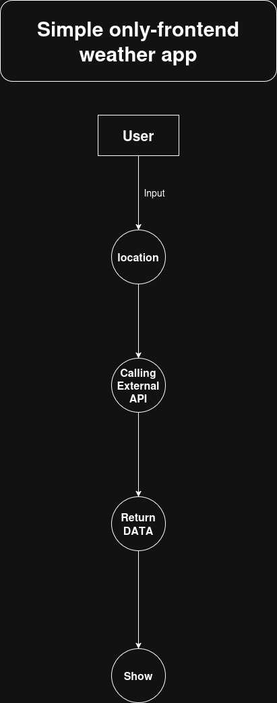

# Weather APP

## This is a simple weather application that provides current weather information for a specified location. The app fetches data from a weather API and displays it in a user-friendly interface.

## Tech Stack
 - React
 - Vite
 - Tailwind CSS
 - TypeScript

## Simple Architecture



## How to run

- Clone this repository
- copy .env.example to .env and fill the values
	```bash
	cp .env.example .env
	```
- Install dependencies: `npm install`
- Run the development server: `npm run dev`


### Project source link
[Project source](https://roadmap.sh/projects/weather-app)